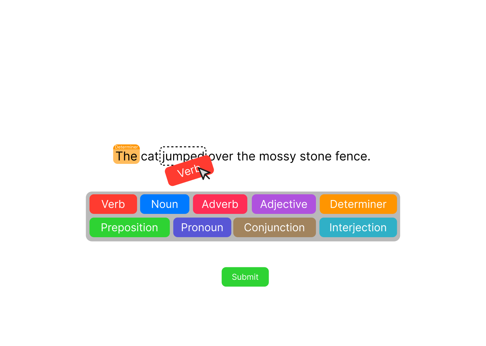

# word-type-practice

A small static site where you drag and drop each label onto each word then submit your choices to see how well you matched the correct labels.

#### This is a mockup made within Figma.

## How I'm planning to build it
- Github hosting
    - HTML, CSS, JS
    - 2D canvas js lib
    - file containing sentences

## TODO list
Can be found in Github project.